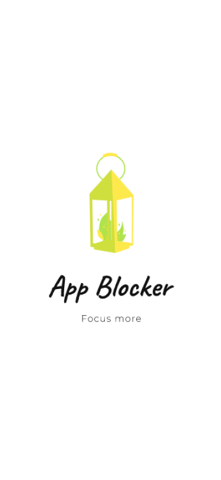
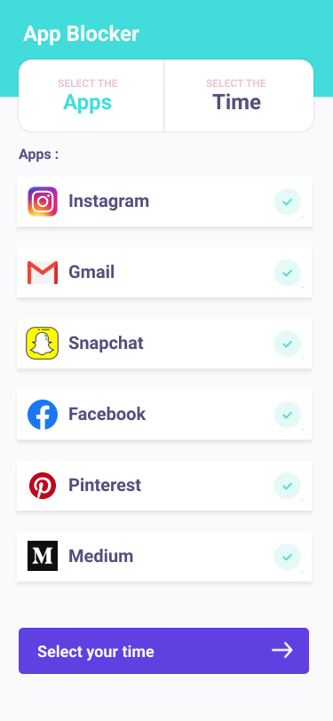
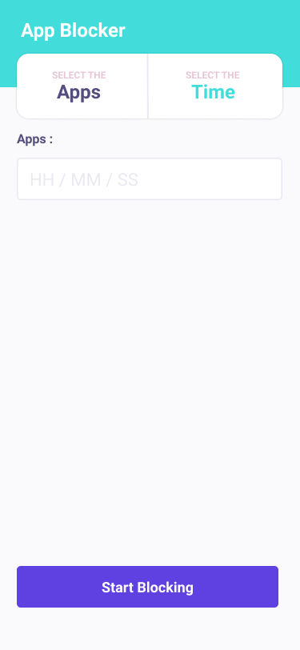

# AppBlocker
Mobile applications do make our life easier but also distracts us from focusing on our work. Wouldn't it be easier if you could block those distracting applications while you want to focus on something? AppBlocker can help you with these problems. It simply lets you select a list of application that you want to block for the given period of time. So next time you won't be able to operate an app that is blocked for the given amount of time.

#### How it Works
Once the user has submitted the amount of time and a list of apps to block. We store this data on a local database (SQLite).
The main task of blocking an app is done by a background service. The service continuously fetches the foreground ( currently active) app and queries through the database to check whether this app is blocked or not. If the app is blacklisted then we display a blank activity on the screen, thus preventing the user from operating the app.

#### Screenshots
    
